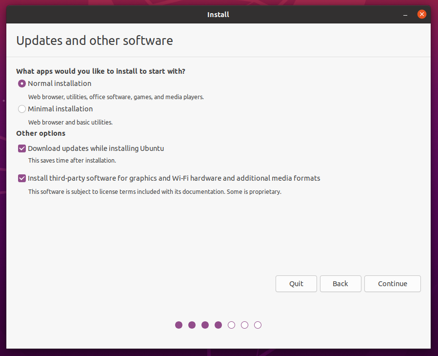
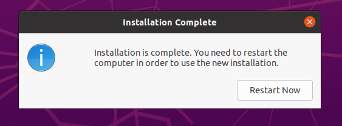

# Installation of Ubuntu Operating System

## Overview
The goal of this tutorial is to provide a step-by-step guide on how to install the operating system (os) Ubuntu, the version that is used in this tutorial is Ubuntu 22.04.1 .This guide is a simplified version that was adapted from the official Ubuntu tutorial guide which is found on this [Ubuntu official tutorial link](https://ubuntu.com/tutorials/install-ubuntu-desktop#10-complete-the-installation). 

The Ubuntu image that will be used can be found online. For the purpose of the workshop you will be provided with a flash drive that contains the iso image that is used for installation.

## Boot from USB
Restart your pc after you have inserted the usb flash drive. The media should be recognised automatically, but if not press and hold F12 during the start up process. This will allow you to select the usb device from the boot menu.

> In the case that pressing F12 doesn't direct you to the boot menu, there is a message that appears on the screen when the machine is starting up which states which key to press to access the boot menu.

Once this is done correctly you should see a screen that looks like the one shown in [Figure 1](#fig1), click on the **Install Ubuntu** option.

<span id="fig1" class="img_container center" style="font-size:8px;margin-bottom:20px; display: block;">
    
    <span class="img_caption" style="display: block; text-align: center;margin-top:5px;"><i>Figure 1: Ubuntu welcome screen for installation.</i></span>
</span>


This is will prompt you to a screen where you will select your keyboard layout, for our purposes we will select **English (US)**

## Installation Setup
At this stage of the installaton you will given two options namely: normal installation and minimial installation. The minimal installation option is most commonly used when dealing with smaller hard drives or when pre-installed applications are kept to a minimum.

For this tutorial we will select the **Normal installation** option. A screen should appear as shown in [Figure 2](#fig2), there is a section called **Other options** those checkboxes should be left unticcked for the purpose of this tutorial. Usually those two boxes to dowload updates and install third-party software would to checked, ensure that you have the latest updates related to the version of Ubuntu that you are installing, this will also require your machine to be connected to the internet. If you are not connected to the internet, you will be prompted to do so at this point and ensure that you remain connected for the rest of this installation process.

<span id="fig2" class="img_container center" style="font-size:8px;margin-bottom:20px; display: block;">
    1
    <span class="img_caption" style="display: block; text-align: center;margin-top:5px;"><i>Figure 2: Installation type screen.</i></span>
</span>


The next step is dealing with disk management, since there is no other operating system that has been installed prior to this and we want Ubuntu to be our only operating system, we will select the first option which is **Erase disk and install Ubuntu**. There is no need for any advanced features so leave it as none selected, then click the **Install Now** option. A pop-up will appear asking for confirmation of the changes that will be written to the disk, select **Continue**.

When connected to the internet your location will be automaticallly detected, but if not make sure that you select the correct location on the map screen.  The next step will deal with login details, fill in the details that are required for this screen. Make sure that you select the **Log in automatically option** , it is good practice to have a password for security but for the purpose of this tutorial that won't be necessary.

Now the instalation will take place, once it is complete the machine will prompt for a restart as shown on [Figure 3](#fig3). Click on **Restart Now**, when restarting you will be asked to eject the USB flash drive then press Enter. You will logged in to the machine with your Ubuntu operating system.

<span id="fig3" class="img_container center" style="font-size:8px;margin-bottom:20px; display: block;">
    
    <span class="img_caption" style="display: block; text-align: center;margin-top:5px;"><i>Figure 3: Restart Prompt.</i></span>
</span>


## Update software

It is good practice to ensure that your system is update at all times. An update can be done either via the terminal or using the software updater. For the purpose of this tutorial and the rest of the course we will make use of the terminal. In order to perform this software upadte an internet connection is required.

> To open the terminal you can either click the terminal icon on the sidebar or use the short-cut **CTRL+ALT+T** 

In the terminal type this command:

```
sudo apt update
```
This will usually prompt for a password which is the same as the login password if one is set. A check for any updates will be done and you will be notified of any avaliiable updates. To apply any updates, type:

```
sudo apt upgrade
```
You will type **Y**, then **Enter** to finish the update process. At this point we can just run a reboot just to make sure that changes take into effect (Also good practice), the machine will reboot and come back on.

```
sudo reboot
```

**Well done your Ubuntu installation is now complete.**