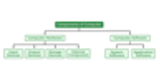
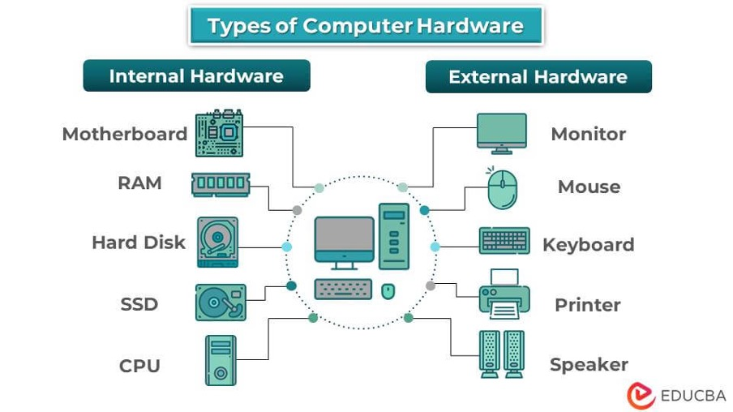

# Computer Hardware 
Once this is done correctly you should see a screen that looks like the one shown in [Figure 1](#fig1), click on the **Install Ubuntu** option.

    
    <i>Figure 1: Computer components.</i>

## 1. Computer Components
a. **Hardware** is any element of a computer that's physical. This includes things like:
* Input devices: Keyboards, mouse etc.
* Output Devices: Monitor (computer screen), printer etc.

b. **Software** is anything that tells hardware what to do and how to do it, including computer programs and apps. This includes things like:
* Application software: Software that fulfils a specific need or performs tasks, eg: Microsoft office tools.
* System software: System software is designed to run a computer's hardware and provides a platform for applications to run on top of, eg: your OS.

## 2. Computer Hardware
* There are two types of computer hardware: external and internal. External hardware devices include monitors, keyboards, printers, and scanners, whereas internal hardware devices include motherboards, hard drives, and RAM.

    
    <i>Figure 2: Types of Computer Hardware.</i>

