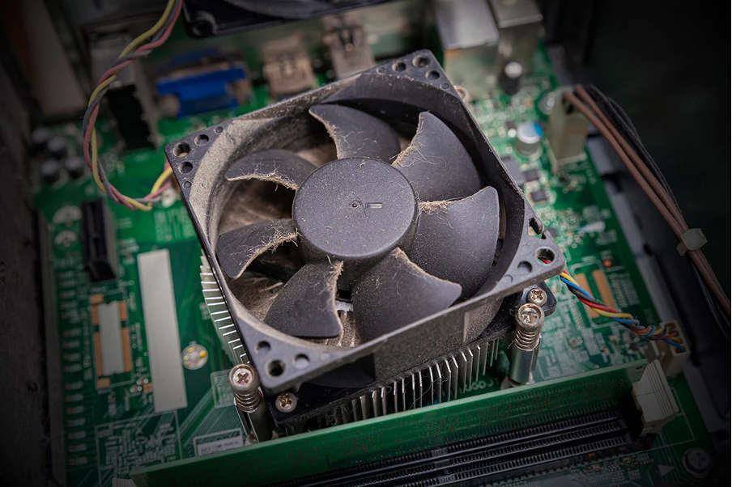
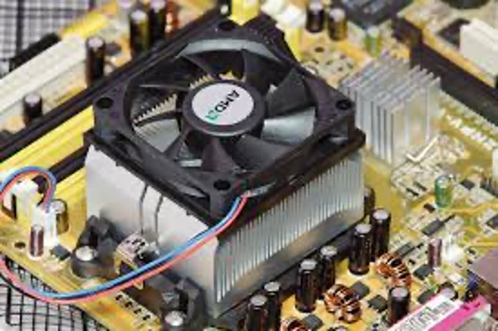
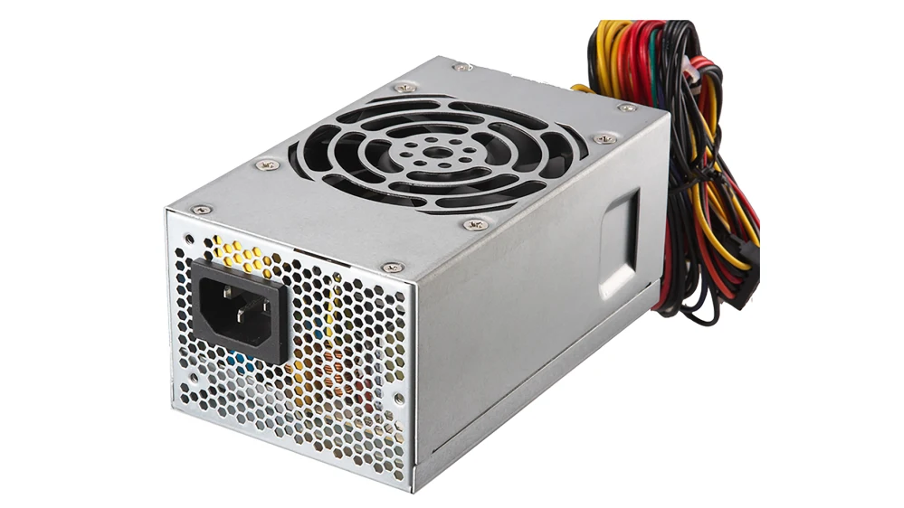
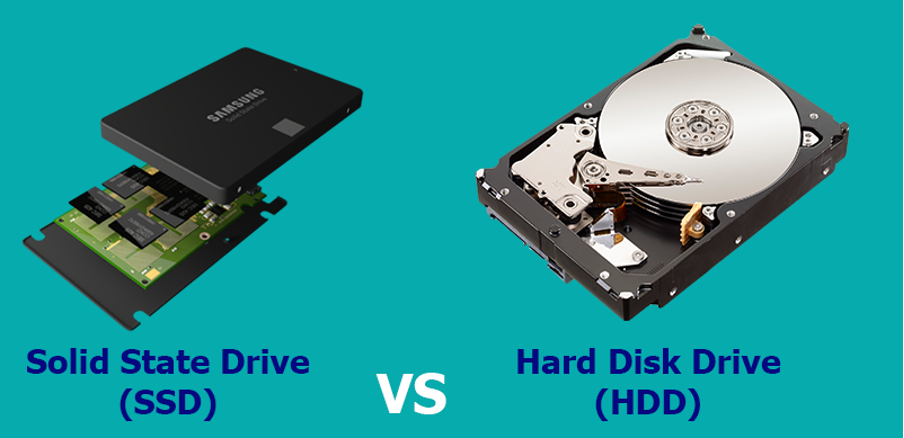
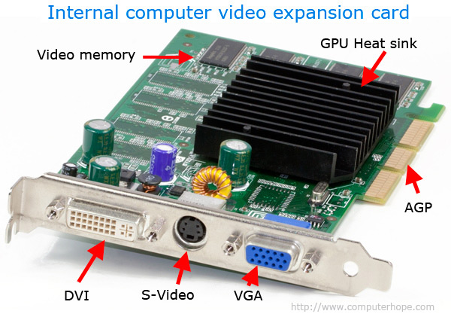
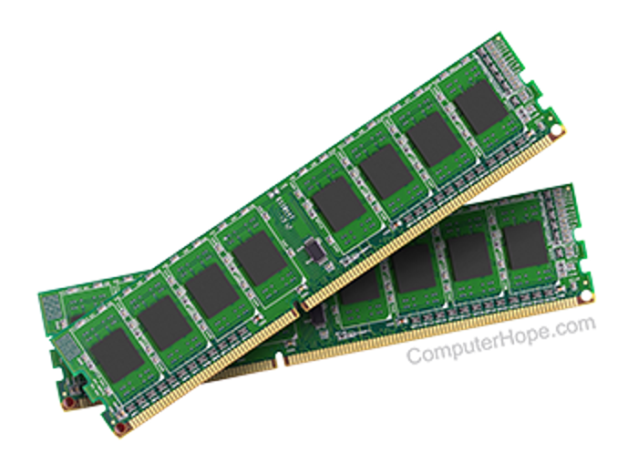
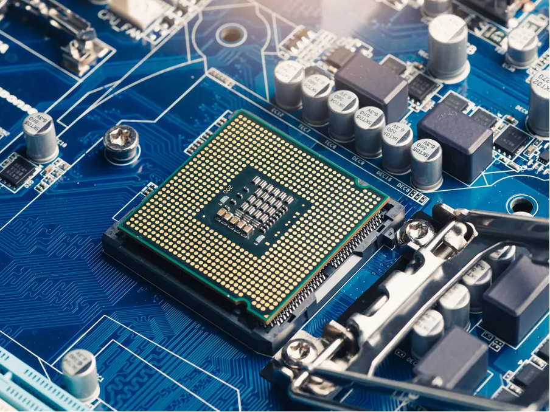
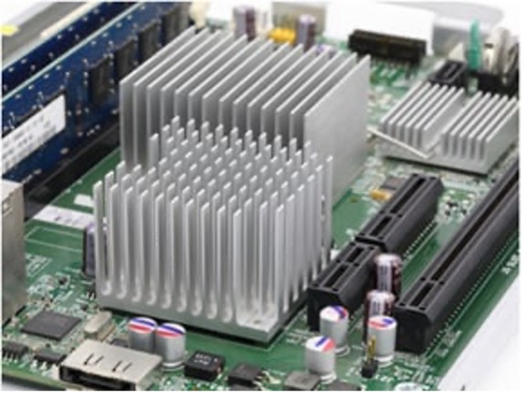
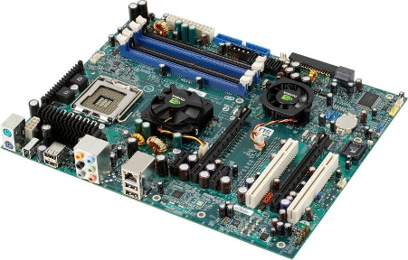
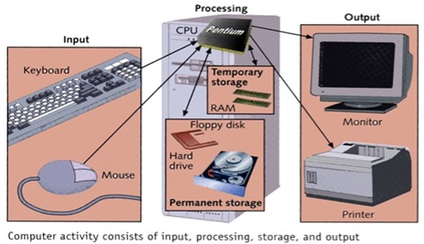

# Computer Hardware 
## Overview of computer hardware components
The goal of this section is to identify the different computer hardware components and their functionality. They are also listed in the order that can be followed when disabling the computer parts.

    
    <i>Figure 1: Computer components.</i>

## 1. Computer Components
a. **Hardware** is any element of a computer that's physical. This includes things like:
* Input devices: Keyboards, mouse etc.
* Output Devices: Monitor (computer screen), printer etc.

b. **Software** is anything that tells hardware what to do and how to do it, including computer programs and apps. This includes things like:
* Application software: Software that fulfils a specific need or performs tasks, eg: Microsoft office tools.
* System software: System software is designed to run a computer's hardware and provides a platform for applications to run on top of, eg: your OS.

## 2. Computer Hardware
* There are two types of computer hardware: external and internal. External hardware devices include monitors, keyboards, printers, and scanners, whereas internal hardware devices include motherboards, hard drives, and RAM.

    
    <i>Figure 2: Types of Computer Hardware.</i>

a.) **System fan**:

It is used for active cooling by blowing air into the computer components and warm air out.

    
    <i>Figure 3: System Fan.</i>

* You will start by removing the system fan first. It is located at the back side of the computer, the side with all the component plugins.

* First, unplug the fan from the motherboard. You can find the plug by following the wire from the fan. It should be labeled "SYS_FAN1". Next, you will have to unscrew the fan from the outside. You should now be able to lift the fan out of the PC.

b.) **CPU fan**:

The one blowing air onto the CPU heat sink.

    
    <i>Figure 4: CPU Fan.</i>

* Now that the system fan is out, we can remove the CPU fan.
* The CPU fan is located right on top of the CPU heat sink, which is a large piece of metal with fins on the top. The CPU fan plugs into the motherboard in an awkward place, that is hard to access. But just follow the wires and you should easily find it. It is labeled "CPU FAN1". To remove the fan from the heat sink, remove the four screws securing it in place.

c.) ** Power Supply**

It converts the alternating current (AC) from a wall socket of mains electricity to a low-voltage direct current (DC) to operate the motherboard, processor and peripheral devices.

    
    <i>Figure 5: Power Supply.</i>

* The power supply is a large metal box located at the upper-back part of the computer. They sometimes come with an on/off switch that is acessable from the back of the computer. The main power cord also plugs into the back of the power supply.

* The power supply supplies power to every component in a computer, therefore it has the most wires out of every other component in the computer. The first thing we will do is unplug every wire coming from the power supply. The list below is everything that needs to be disconnected:
Motherboard (very large connector/plug), 
CD/DVD drive(s) power, 
Internal hard drive power, 
Portable hard drive slot power.

d.) **Hard Drive**

Is the primary storage device located inside a computer system. Your documents, pictures, music, videos, programs, application preferences, and operating system represent digital content stored on a hard drive. Hard drives can be external or internal. 

* First off, de-attach the connector at the back of the slot, and unplug the other end from the motherboard. Also unplug the SATA cable from the motherboard and the hard drive. The portable hard drive slot is secured the same way the CD/DVD drive is, with a tab. Pull on the tab, then slide the slot out.
To remove the hard drive from the side of the slot, unscrew the four screws securing it in place.

e.) **Solid State Drive**

Are the most common storage drives today. SSDs are smaller and faster than hard disk drives (HDDs). SSDs are noiseless and allow PCs to be thinner and more lightweight.

    
    <i>Figure 6: Hard drive and SSD.</i>

f.) **Expansion Cards**

An expansion card, also known as an expansion board or add-on card, is a hardware component that you can insert into a computer's expansion slot to enhance its functionality. These cards provide additional features and capabilities that the computer's basic configuration may not have initially included. Some common examples include graphics cards, sound cards, network interface cards (NICs), WiFi cards, universal serial bus (USB) expansion cards, and storage controller cards such as redundant array of independent disks (RAID) cards.

    
    <i>Figure 7: Expansion card.</i>

* There should be a single screw on top of each expansion card slot, whether it's occupied, or empty. Remove the screws on the occupied card slots. Once the screws are removed, you should be able to remove the cards by pulling them carefully upward. Some expansion cards have cables leading to other parts of the computer, for example, the TV card is connected to the connectivity centre on the front of the computer. You will have to unplug any cables attached to an expansion card, before removing the card itself.

g.) **Random access memory (RAM)**

Is your computer or laptop's short-term memory. It's where the data is stored that your computer processor needs to run your applications and open your files. It is to be noted that the more RAM you have, the faster your computer runs. Most computers typically have 4 RAM slots, and two RAM chips.

    
    <i>Figure 8: RAM.</i>

* To remove the RAM, push down on both tabs holding the RAM in place, which are located at both ends of the RAM.

h.) **Central processing unit (CPU)**

It interprets, processes and executes instructions, most often from the hardware and software programs running on the device. The CPU performs arithmetic, logic, and other operations to transform data input into more usable information output.

    
    <i>Figure 9: CPU and heat sink.</i>

i.) **CPU heat sink**

Is a piece of metal that sits on top of a computer chip such as a CPU and draws power away from components by letting it rise through a series of fins.

    
    <i>Figure 10: Heat sink.</i>

j.) **Motherboard**

A motherboard is the main printed circuit board (PCB) in a computer. The motherboard is a computer's central communications backbone connectivity point, through which all components and external peripherals connect. Motherboards can be found in virtually all computers, especially desktop and laptop PCs.

    
    <i>Figure 11: Motherboard.</i>

## 3. Computer Information Processing Cycle

    
    <i>Figure 12: Computer Information processing cycle.</i>

a.) **Input**

In the input stage, the data is entered into the computer. There are many ways to do this. In fact, there are as many ways to input data as there are input devices. You would have learned about input devices in Grade 10 but just to refresh your memory, input devices are things such as keyboards, touchscreens and microphones. The user inputs the data (for example, by typing on a keyboard or speaking into a microphone) into the computer. The device takes this data and converts it into a series of 1s and 0s (this is called binary code).

b.) **Processing**

The central processing unit (CPU) inside the computer then takes that binary code and does the calculations needed to get that data to display in a way that makes sense to the user. The CPU works with the computer’s memory to get instructions on how to display the information from the input device and stores it as pixels in the computer’s memory. This information is sent to the output device to be translated and displayed in a way that is useful. All of this takes a fraction of a second to do.

c.) **Storage**

Storage is where the computer takes the input and stores it in its memory banks. There are many ways to store the data, but the basic process is as follows:
* The CPU writes the data to the computer’s temporary storage, or random access memory (RAM).
* The computer then waits for the user’s command to move the data from the RAM to more permanent storage. If that command is given, the computer writes the data to the disk drive.
* Lastly, the computer saves the data in a location on the drive, either the default storage location or a location set by the user. The user can then recall this stored information at any time.

You can also store information using external storage devices (for example USB drives or external hard drives).

d.) **Output**

Output is where the computer takes the pixels from the processing stage and displays them in a way that the user can see them. There are many kinds of output devices, such as printers, screens, video and audio devices.
These devices make the raw data usable and visible, allowing human users to interpret the data, turning it into information. This could be the sound waves of a song or the letters in a document.

