# Installation of Ubuntu Operating System

## Overview
The goal of this tutorial is to provide a step-by-step guide on how to install the operating system (os) Ubuntu, the version that is used in this tutorial is Ubuntu 22.04.1 .This guide is a simplified version that was adapted from the official Ubuntu tutorial guide which is found on this [Ubuntu official tutorial link](https://ubuntu.com/tutorials/install-ubuntu-desktop#10-complete-the-installation). 

## Using Oracle VM VirtualBox
On the desktop, there is an application called **Oracle VM VirtualBox** launch the application. When you have launched the application, you should see a welcome screen as shown in [Figure 1](#fig1). 

    
    <i>Figure 1: VirtualBox Welcome Screen</i>

On the welcome screen there a button written **New** , click on that button and a window as shown in [Figure 2](#fig2) should appear. This is where you add the name to your virtual machine, which VirtualBox uses to identify this machine. For the purpose of this tutorial the virtual machine will be named **Ubuntu22.04**, it is good practice to name a VM by the version of the operating system that will be used. This will allow for the automatic detection of the type and version as seen in [Figure 2](#fig2), the machine folder is the location on your local machine where the vm will be created, then press **Next**.

    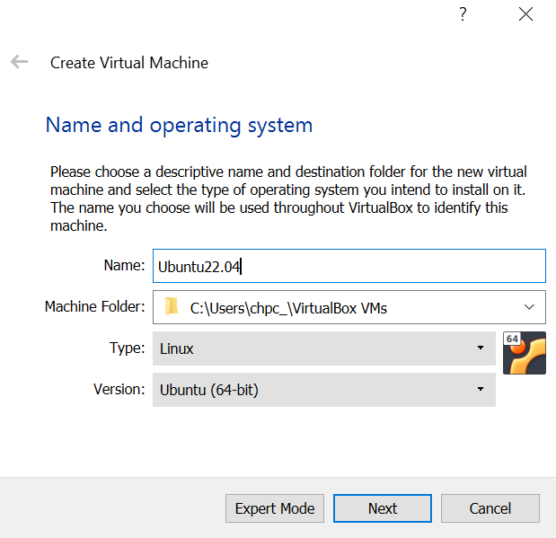
    <i>Figure 2: Creation of Virtual Machine</i>

The next step is to specific the amount of Random Access Memeory (RAM) for the VM. For this workshop we recommend selecting **1800 MB** as shown in [Figure 3](#fig3), when done press **Next**.

    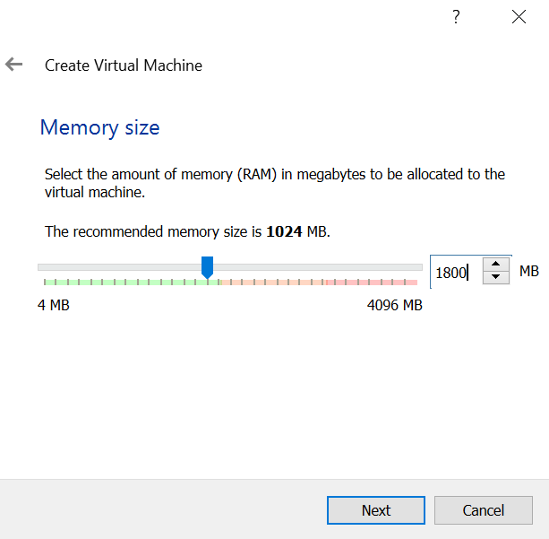
    <i>Figure 3: RAM Allocation</i>

Now is the creation of the hard disk, for this select the second option as shown in [Figure 4](#fig4), then press **Create**.

    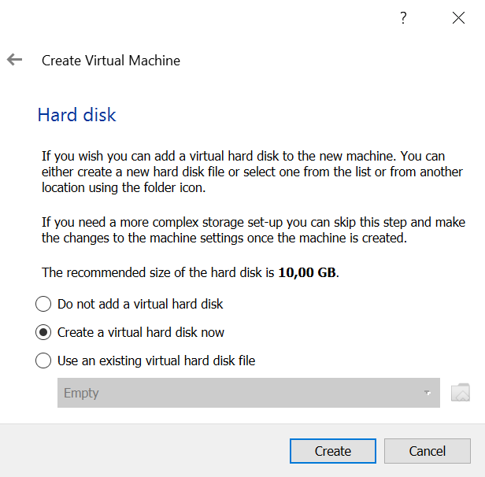
    <i>Figure 4: Virtual Hard Disk Creation.</i>

For the hard disk file type, keep the default selection of **VDI** as shown in [Figure 5](#fig5), then press **Next**.

    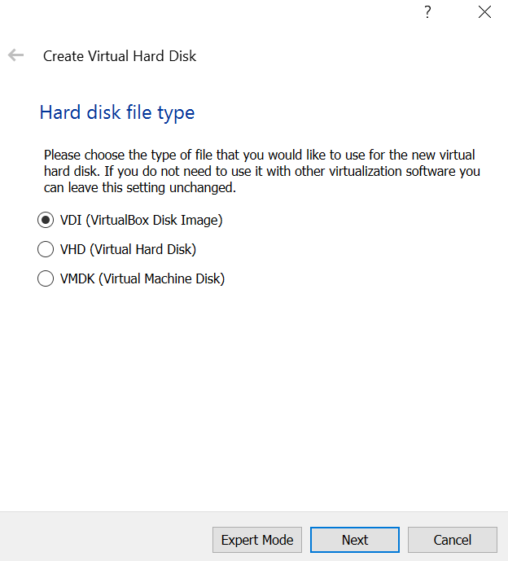
    <i>Figure 5: Hard Disk File Type.</i>

The storage on physical hard disk should be set to **Dynamically allocated** as seen in [Figure 6](#fig6), then press **Next**.

    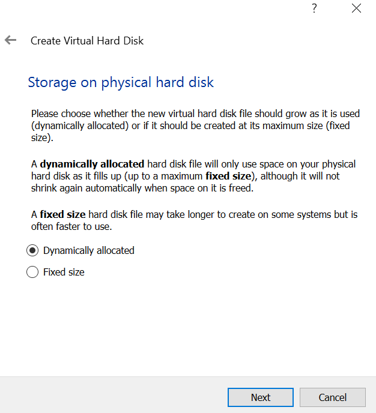
    <i>Figure 6: Storage on Physical Hard Disk.</i>

Now for the file location and size, we will leave the file location as the default that is seen on screen **This will differ from computer to computer**. The size should be set as **30.00 GB**, these settings are shown as [Figure 7](#fig7), then press **Create**.

    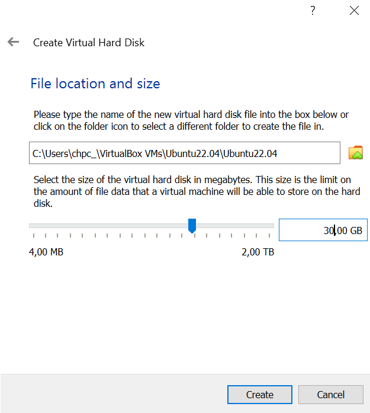
    <i>Figure 7: File Location and Size.</i>

Then the next step will be to get the machine started, on your screen on the left panel you should see the vm that you have created. To start the machine simply press **Start** on the screen, make sure that your machine is selected. This is good practise for when there is more than one vm that is created in your environment.

When the machine is starting up, you will asked to select the start-up disk for the purpose of this workshop your Ubuntu Image will be stored on your C Drive. So you will need to select the **folder with the green arrow**, then on the next screen press the **Add** button. This will allow you to navigate to a location on your local computer, in the left panel you should see a drive named **Windows-SDD**, when you enter that file you should see the Ubuntu image as shown in [Figure 8](#fig8), press **Open**. This will add the image on the optical disk selector screen, then you can press **Choose** when that image is selected. Then now we can press **Start**.

    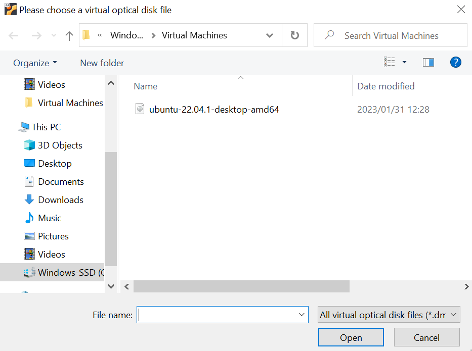
    <i>Figure 8: Virtual Optical Disk File.</i>

Once the machine is started, you will see the menu shown in [Figure 9](#fig9). From there select the **Try or Install Ubuntu** option by pressing the **Enter Key**

    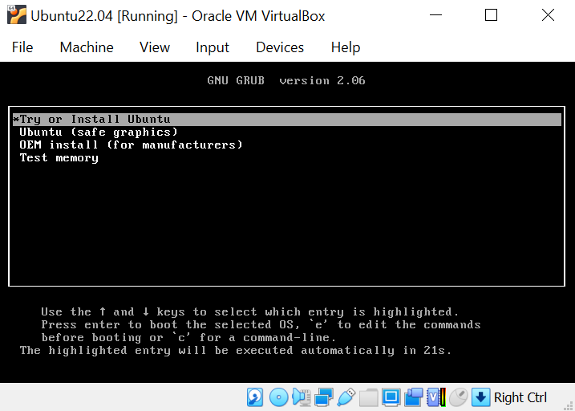
    <i>Figure 4: GRUB Menu.</i>

Once this is done correctly you should see a screen that looks like the one shown in [Figure 10](#fig10), click on the **Install Ubuntu** option.

    
    <i>Figure 10: Ubuntu Installation Welcome Screen</i>

This is will prompt you to a screen where you will select your keyboard layout, for our purposes we will select **English (South Africa)** then press **Continue**.

At this stage of the installaton you will given two options namely: normal installation and minimial installation. The minimal installation option is most commonly used when dealing with smaller hard drives or when pre-installed applications are kept to a minimum.

## Installation Setup

For this tutorial we will select the **Normal installation** option. A screen should appear as shown in [Figure 11](#fig11), there is a sections called **Other options** only one of those options shown will checked as shown in [Figure 11](#fig11).

    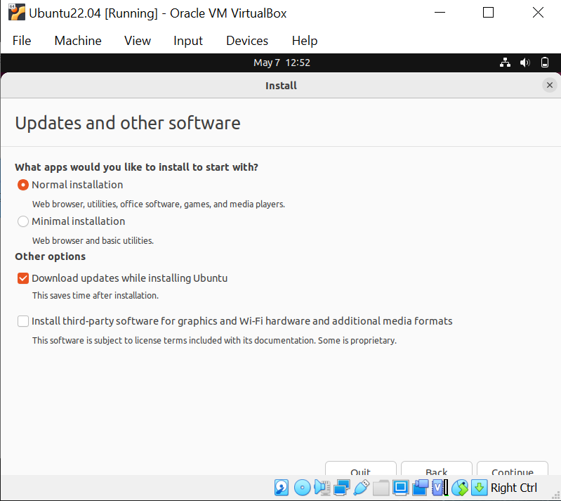
    <i>Figure 11: Installation type screen</i>

> For the **Other options** section, ensure that the computer is connected to the internet.

The next step is dealing with disk management, since there is no other operating system that has been installed prior to this and we want Ubuntu to be our only operating system, we will select the first option which is **Erase disk and install Ubuntu** as shown in [Figure 12](#fig12). There is no need for any advanced features so leave it as none selected, then click the **Install Now** option. 

    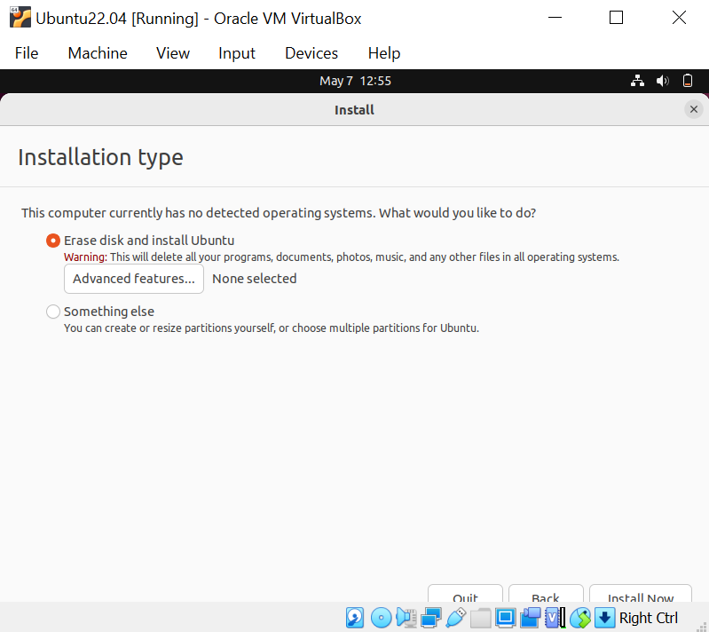
    <i>Figure 12: Installation Disk Management</i>

> A pop-up will appear asking for confirmation of the changes that will be written to the disk, select **Continue**.

You will be asked to select your location on the map, ensure you select the correct location then press **Continue**.  The next step will deal with login details, fill in the details that are required for this screen. Make sure that you select the **Log in automatically option**, as shown in [Figure 13](#fig13)

    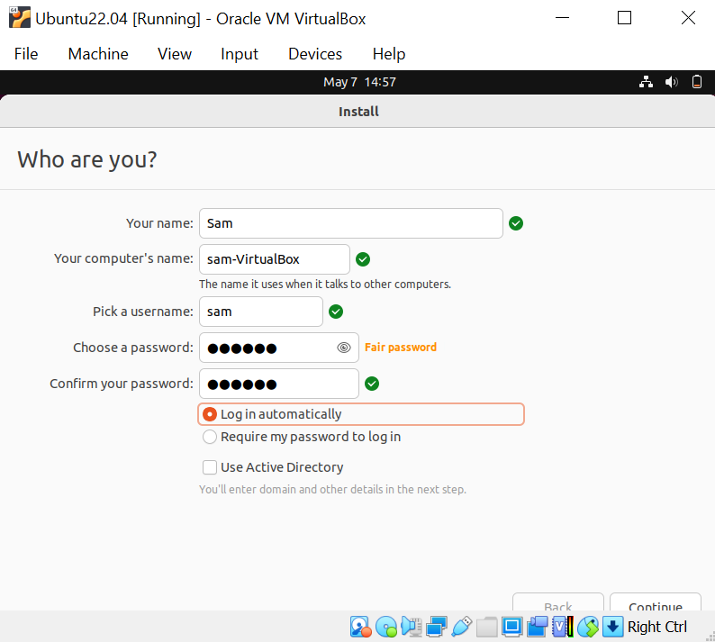
    <i>Figure 13: Who Are You Page</i>
  

> Ensure that you remember your password because if you are locked out we can not assist.

Now the instalation will take place, once it is complete the machine will prompt for a restart as shown on [Figure 14](#fig14). Click on **Restart Now**, when restarting you will be asked to remove the meduim, press Enter **In our case there is no meduim to remove just press Enter**. You will logged in to the machine with your Ubuntu operating system.

    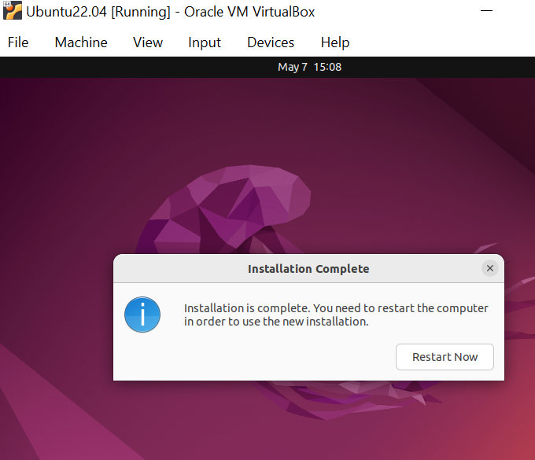
    <i>Figure 14: Installation Complete</i>

**Well done your Ubuntu installation is now complete.**